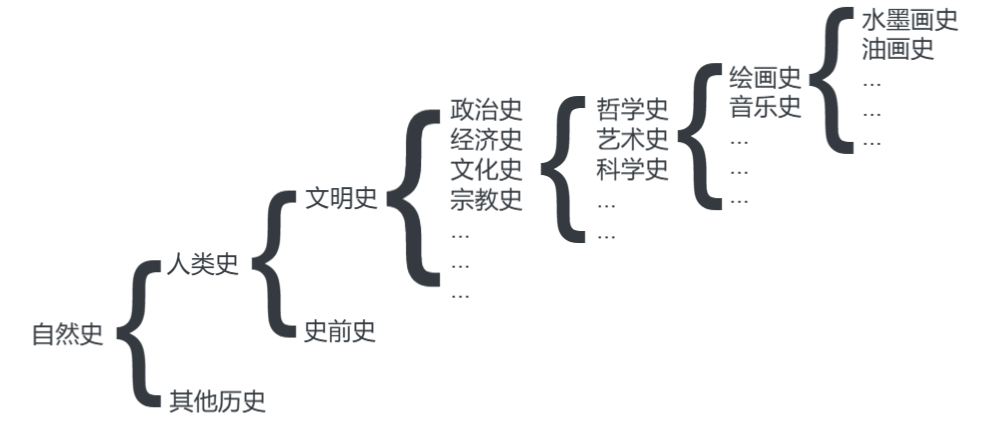

# 当今之世，博学何以可能

[TOC]

## 一、博学

对人类既有的文化资源知识门类及重要成果了如指掌，并能够进行灵活精准的调用；
**博学的价值在于解决问题**，尤其是在于目前网络发达，答案基本就可搜索得到，灵活代表有更多思路和依据，精准在解决问题的时候更加具有效力；

社会及思想方面的内容可以细致化的操作，在这一点上现代社会学心理学中有所欠缺、有待发展；

如今的信息爆炸导致一人无法将所有信息都知晓，而能够达到博学的一个路径在于，分类系统检索，即为图书馆常见的书籍门类分类系统，从领域问题能够反映并调动目录调用思考路径；
博学并非上知天文、下知地理、知晓古今这样古典般的认识，而是在于联系与调动知识进行问题解释与解决的能力，即实践这个方法论的能力；

## 二、无法博通的门类

### 以信仰和神秘体验为前提的知识和学术

比如 轮回 死后世界等学说 ，往往是神学范畴，具有一道壁垒

> 任何宗教内部学说都是这一门类下的， 其显著特点在于破坏了博学所依赖的认知通路；

### 技术

技术有非常专门化和琐碎的内容

> 起初技术有其深度才能成为技术，或者我们可以说知识结合实践的操作才能够成为技术，而实践需要付出巨大的时间精力的代价挤压了博学的空间，并受到现实的范畴限定，无法铺展，只有深入，辩证的是，在深入过程中也会有其他学术知识范畴被卷入该技术，其实技术的深入和进步反而可能促成人“博学”的可能；例如一个传统手工吉他学徒开始学习CNC做吉他并接触计算机科学、切削力学等学术范畴的可能性历程；
> 其实也看作知识在于实践层面的验证，世界只会对正确的动作做出应然的反映，否则其中必然有未被认识者卷入，在其中发挥作用；
> 其显著特点在于打破了博学依赖的历程基础（人的时间和精力？）；

### 分类学

分类学家在早期是真正的博物学家，如分类学大师林奈，就是当时最为博学之人
然而如今一人知道动物分类、星星的分类，已经由于信息爆炸难以做到，且表面上的的分类和属性的堆砌无法解决当今人类的复杂问题；

> 分类只是对现象做定在，划定各类观察所得资料的界限和关系，确定各门类知识发展的范畴；
> 毕竟能指滑动不利于依赖范畴确定性的具体学科的发展的，尤其在于自然科学；
> 我拿到了毛坯房，这个远离马路较安静作为书房、那个采光好作为客厅；

## 三、可以博通的领域

其具有两个特点，理论层面可以普遍验证，有理论化程度较高；

### （1）传统学术--既往皆史

宏观及概貌，指掌其源流
该学术特点在于其严谨性较现代科学不够，在于

方法是用史学的方法来把握传统学术，学者先立其规模；

首先树立自然史，将小的门类先放入其分类体系；
如史学或考古学，其技术含量和验证严谨性较现代科学不够；

 其脉络下，越是向前的历史越是简洁粗糙；越向后越有纵深（规定性的递增）， 儿童读物毕竟和青年读物的深度不同，其差异量不断递增；

把握整个脉络，当在遇到任何问题的时候进行分类上的定位，能够准确的找到巨人肩膀上的立足点；掌握表象的宏观，和发育脉络
领域的研究成果必然具符合普遍经验，有普解性；

如 人类社会的研究成果不只是能够在现代社会有合理的适配，其必然应该解释历史上各类社会的原因，否则其应该叫做现代社会学/工业社会学，解释社会在自然中的表达如何才行，将一切在研究对象内的表象都要溯其源头原因；

> 为保证的研究成果的完善和精准，必须不断对现象的堆砌进行有机的整理和解释，这样的学说才是不断进步的善的，而UP讲的对于生物演化史的了解，个人认为是在溯源过程中必然向相邻相关或宏观一级领域的寻求依据和证据的手段，宏观一级的领域内容可能对当前所研究领域内容有其作为基础而发展出表象的作用，就算其发展过程导致了失真，即生物演化的“生物基础”是“人类社会”的某些现象的成因，继而做更加复杂的规定性向后推进梳理；如同“性”之于“爱情”之于“资本化享乐”；

### （2）现代学术

总概哲思统一（哲学），精分各科原理（科学）；

必须有成熟的哲学理论系统打底，西方现代哲学几乎放弃了建立面向存在的统一体系这一工作，最近的一位是海德格尔，然而他失败了，其更加注重人的生存；
对任何表现进行研究，需要有一个上手的入口，材料的预处理、排序、标准化；
推荐 王东岳 《物演通论》

科学：

能够掌握各科原理，如物理的相对论、量子论，化学的电子轨道，生物的遗传理论；对现代科学的理论基础有整理把握，解决问题的思路如何，原则如何，方法如何，成果如何，领域是确定的，物理--化学--生物学--心理学--社会学，能够在现代成果上有整体把握，在解决问题的情况找到相应材料以及评价该材料优劣和适配；

> 这里即为自然哲学的内容，谢林的自然哲学，在其著作《先验唯心论》和《近代哲学史》中都有提到从世界如何从基本的自我对抗演进提高潜能阶次的环节步步向上构建当前世界，并接近达到自身原初目的，磁-电-化学-有机物-生物细胞-人类-社会-国家，虽然不完全准确，但一系列构建的脉络已经被提出，每一个环节内部对抗的稳固导致成为背景秩序，而新的矛盾提升为新环节中的对抗；

知道历史大环境，并知道自然科学的效用，能够在科学层面落实，意味着可以有精确的技术操作，那么就可以精确的解决问题；
这需要充足的时间，储备梳理整个图谱；
遇到问题后就需要，定位理论框架，检索其详细知识的来源

> 梗的真正含义 

哲学可以训练思维，也可以作为路标，科学可以确定研究的基础，如社会学者有些反对生物主义，但是依然不可动摇可以从生物学推演出心理为何如此细腻的基础；

>  更基本的阶次的内容决定了后续学科的基础

 哲学各个领域的原理，是为了精确化解决本领域的问题；化学领域的氧化还原在生物领域就显得粗糙，心理学有适配性结构，社会学有人文基态重演；

而其中哲学原理都是同一的，其就是人类最高智慧；

## 四、注意事项

博学并非全知全能，而是能够快速准确反映；

若无文化上的突破和创造，博学毫无价值：若不进行突破，就算把人类知识完全继承下来，也只能是知识保存期限只有几十年的硬盘；

博学是时限的：博学的最好年龄为5-25 ， 对人类文化有宏观了解，若基础不牢固，则研究有缺憾；尤其在交叉学科的研究；

在科学研究的序列上越后卫的学科对从业者的博学素养越高：如同学化学不懂物理是可笑的，而物理学家可以不懂乐理，学科分类有其阶层和次序，基础学科的奠基较为重要，必须了解基础学科研究者在讨论的内容；

只有宏观的把握，研究才能得到更加普遍适用的成果；

评：

> 设立一般非总体框架或体系首要任务（“非总体”指的统一永恒的最终形而上学说），在对于复杂的现实做出可能性的阻断，这样可能会减弱辩证法的贯穿力，俗话叫“不够野”，不过这是对于现代分类学科需要专题化的妥协；
>
> 鉴于UP想要开创新社会学，而不是新哲学体系，那么对于一些看来较为严苛和不自由的范畴预设则无需过多诟病；
> 但是要注意真正的结果一定会受到预设的影响，到时候我们将再次回到开头；
>
> 
>
> UP的几个重点
>
> 1 博学定义为建立知识图谱数据库，并具有超级快查能力，和评优能力，作为解决问题的基本图式；
>
> 2 以历史的角度（这里指发展历程，不是哲学上永恒的对立面的历史性），确定大致的脉络，作为大致范畴，确定需要深入考察的现代科学领域，并寻求技术性较强的精确操作，以得到解决问题的强有力手段；
>
> 3 体系学说的包容性要强，能解释现象越全面，成果越完善；
>
> 4 世界表象的各个范畴具有阶次，同构的，具体的现代科学也形成相应阶次，仅看前后关系，分为基础和后续，基础对后续具有奠基性、难以逾越性，后续具有的额外规定性导致了其更加具有时效性和实践可能；后续可以是下一环节的基础；
>
> 
>
> 问题
>
> 对于社会这种无数次自指和迭代的独立个人的复杂集合，是否真的可以进行外科手术般精确化的操作？解决问题的代价会不会成为新的问题需要解决？ 
> 当博学者在考量自己的思维图式的时候形成的新连接，形成的二阶知识，是否成为一个新的实体，成为博学无法完成的永远前置者？是否只有黑格尔的回溯结构能解释？

