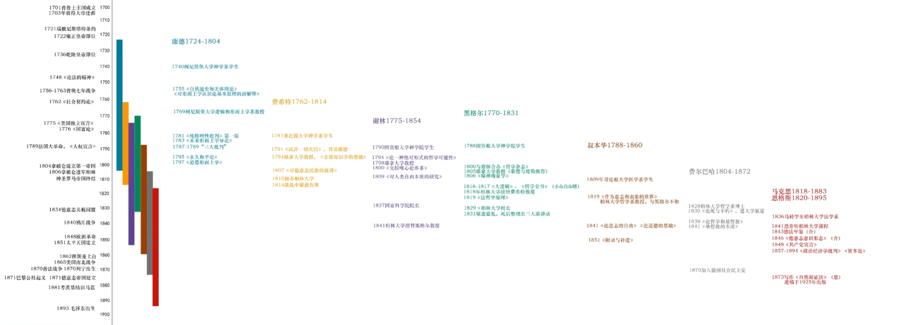

# 前黑格尔思想史

[TOC]

## 零、引

存在即合理，常常被错用，好似被用来论证不符合伦理存在；但此种错用其实包含在愿意中；

原话出现于《法哲学原理》，《小逻辑》中也有提到，本来用于论现代国家的构建，原话：**“理性的都是现实存在的，现实存在的都是合乎理性的”** ；这里现实存在和理性的自证循环，指出浪漫的自由主义者想象的内容，正确与否都有同样根据的，若想要反对自己认为错误的内容，必须投入实践，将你认为正确的内容变为现实；

## 观念论产生的历史背景与人物

 

德国观念论的四大代表人物：康德 费希特 谢林 黑格尔

### 康德

1748年 孟德斯鸠《论法的精神》，资产阶级启蒙运动开始，开始考虑如何把属于国王的自由原则推广到每个人身上 ；

1781年 康德第一版《纯粹理性批判》出版，1787-1789 三大批判 是康德的核心理念；开始向传统形而上学提出挑战；

三大批判：《纯粹理性批判》讲人能认识啥；《实践理性批判》讲人能做点啥；《判断力批判》讲人能寻思啥；

传统形而上学（俗称前康德）寻求“永恒不变”的三大命题：意志自由，灵魂不朽，上帝存有；我是否意志自由，世间本源是何物，最终之善在何处；

**鉴于人们上千年未得到有说服力的答案，康德需要检验是否人们的研究方式方法出了问题，于是宣布要对理性进行反思**；康德认为有些事物是理性无法认识的，认知是先验普遍的，而被认知的要符合认知框架，无法认知之物叫做物自体，可认识的便是现象界；于是其开始详细整理前人工作；

康德提出逻辑判断表和先验理智概念：

|                | 量                     | 质                     | 关系                                                         | 样式                                         |
| -------------- | ---------------------- | ---------------------- | ------------------------------------------------------------ | -------------------------------------------- |
| 逻辑判断表     | 全程、特称、单称       | 肯定、否定、不定       | 直言、假言、选言                                             | 或然、实然、必然                             |
| 先验理智概念表 | 总体性、复多性、单一性 | 实在性、否定性、限定性 | 实体性、因果性、共存性                                       | 可能性、存在性、必然性                       |
| 范畴表         | 全部、众多、单一       | 实在、否定、限制       | 离存-自立（实体-属性）、致使-依赖（原因-结果）、互相（主被动互作用） | 可能（不可能）、存在（不存在）、必然（偶然） |

康德提出科学原则：直观公理、知觉预感、经验类比、一般经验思维公准；此外还有很多范畴表；

**康德提出了人认识事物的三个阶段：感性 知性 理性；这个思想成为了整个观念论的重要路标；**

感性：感官感受到外部的直接反应；

知性：把感觉到的感受统一起来，也叫知性统觉（同一所有感觉），人可以把各种杂多的外部感觉统一交会在“我”这里，因此形成了“我”的观念；

理性：在认识到“我”的基础上，利用我的能力和对世界可以产生的影响来改变世界；

> 康德同期很多内容叫做古典，《国富论》-亚当斯密 ，古典乐-巴赫（巴洛克时代最后的音乐家，发扬十二平均律，理论来自明朝朱载堉）

所以如果要进行一定为世人做能够接受或能够说服人们的伟人，必须站在前人的肩膀上，以前人的思想进行后续的发展，若另起炉灶也只是重复前人工作，且不一定有其同等水平；所以康德分析了人认识世界所依赖的一些工具；哪怕我们不认识康德，在生活中也必须面对很多康德提出的问题，只是这些问题表现得更加具体（生老病死、悲欢离合、思考皆有理性，是理性就躲不开，认识论）；

### 费希特

费希特是“正反合”方法的始作俑者，认为康德并未完成工作，认为康德的范畴过于分散、是化成表格的静态的体系；费希特认为范畴是可以推演的，物自体出发提出自我非我的思想形式；

> 费希特生涯，其生活在拿破仑征服欧洲期间，其将启蒙思想在欧洲推广、并统治世界、欧洲国家在这种压力下获得了自觉和觉醒（痛苦让人寻思怎么能不痛苦），1814年再次拿破仑再度崛起（百日王朝），再次打到了普鲁士（莱比锡战役），期间费希特和其夫人救治伤员感染伤寒趋势；

### 谢林

费希特的学生，谢林是个天才，15岁进入神学院、其理论具有灵性，思想体系清澈又晦涩，核心清澈阐述晦涩，黑格尔称其晦涩感是黑夜中的黑牛；谢林将费希特的思想再以发展，核心思想在《先验唯心论体系》一作，谢林的《近代哲学史》是入门德国观念论最好的教材；

> 黑格尔、谢林、荷尔德林 三人当时是室友，在法国大革命的消息传到耶拿大学后，三人在大学后院种树，称为自由之树，三人年轻时都被当时的思想史发展所震撼，致力于推广人类理性；

由于谢林的思想体系跳脱强，不能让一般人看懂，就违背了自由原则，黑格尔于是开始和谢林体系的阐述方式出现分歧，开始了自己的哲学；谢林晚期过于强调同一哲学，固步自封开始变得保守，后有天启哲学；由于普鲁士王权的保守性，其希望谢林能够回到柏林大学任教，与黑格尔对冲，黑格尔在柏林大学校长工作上霍乱去世后，谢林接替教席，并讲座，当时马恩两位也在场，并对其保守思想评价不高；

### 后继和超越者

后有黑格尔派的超越者，青年黑格尔派  费尔巴哈 马克思 恩格斯；

### 注：

> 叔本华
>
> 是古典哲学外的人物，强调个人体验，受到当代小资追捧，其反对古典哲学中晦涩和宏大叙事；古典哲学功底较为深厚，著作好读，但如果不掌握德国思想史、那么读者就是读了本鸡汤，无法把握其深层思想；

> 黑格尔和贝多芬几乎同年生死，贝多芬时代的乐器制造技术已经基本定型，当代乐器的样式原理和当时几乎无区别（巴赫时期羽管琴没有轻重音区别） ，贝多芬创造了9首交响乐将那个时代的音乐理念汇总起来；而黑格尔时代、哲学的基本范畴已经确定，那么这样杂多丰富之物，其联系何在 ，黑格尔写出了《哲学全书》给时代做出了综述；两位都是时代思想的缩影，都可以很好的通过自己的职业来生活；两位给人的感受便是、让人感到能够通过努力学会把握一些东西；

## 古希腊至观念论整体哲学思想史纪要

### 古希腊：

古希腊罗格斯传统 logs  逻辑思维，检验联系事物；

努斯 心灵 超越感性 带有生命动力 在世界中展开自己；时空是真理展开的过程；

>  时间就是对于各个环节和段落的一次次否定------黑格尔  只有认为环节不够完善，向下推演才能体会时间；

阿里亚派、智者学派诡辩术 、苏格拉底概念辩证法；即 辩论，礼貌的抬杠

怀疑论：用生命来确证的怀疑论，古希腊很多哲人用生命去确证理论，“人自杀就会死，不，我要试一下没死这东西就不是必然的” ，多大的勇气  ;

> 黑格尔给怀疑论较高的评价，怀疑就是最高的信仰------黑格尔  ，  绝对的否定就是绝对肯定  ，若反对他人提出的内容不是真理，恰恰确证了反对者对真理的信仰，反对者用否定的方法在乎真理 ；

亚里士多德 目的论 高水平唯心主义 理念在现实中实现自己；

### 经院哲学

基督教三段论：神圣 罪孽 救赎 ；人出自神圣，人对神圣的反动产生罪孽， 人通过苦难救赎回到神圣；黑格尔继承了这个构型；

### 西方近代哲学

唯理论VS经验论：唯理论，笛卡尔斯宾诺莎  经验论：休谟怀疑论；

康德：现象界-物自体

费希特 ： 自我非我绝对非我  

谢林：绝对同一

