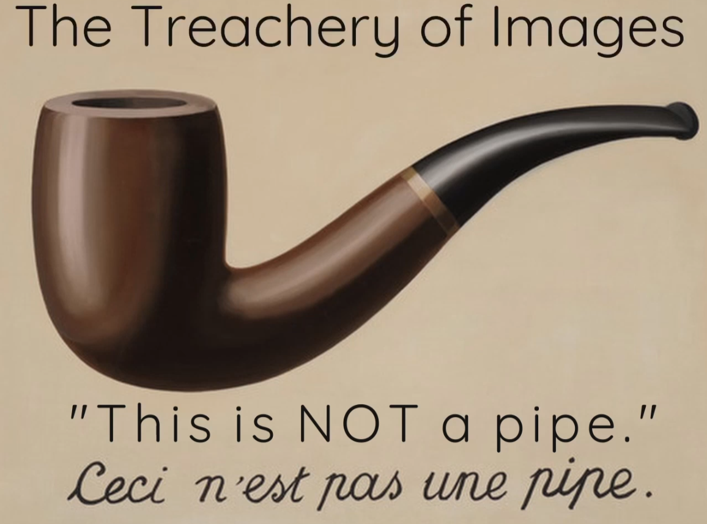
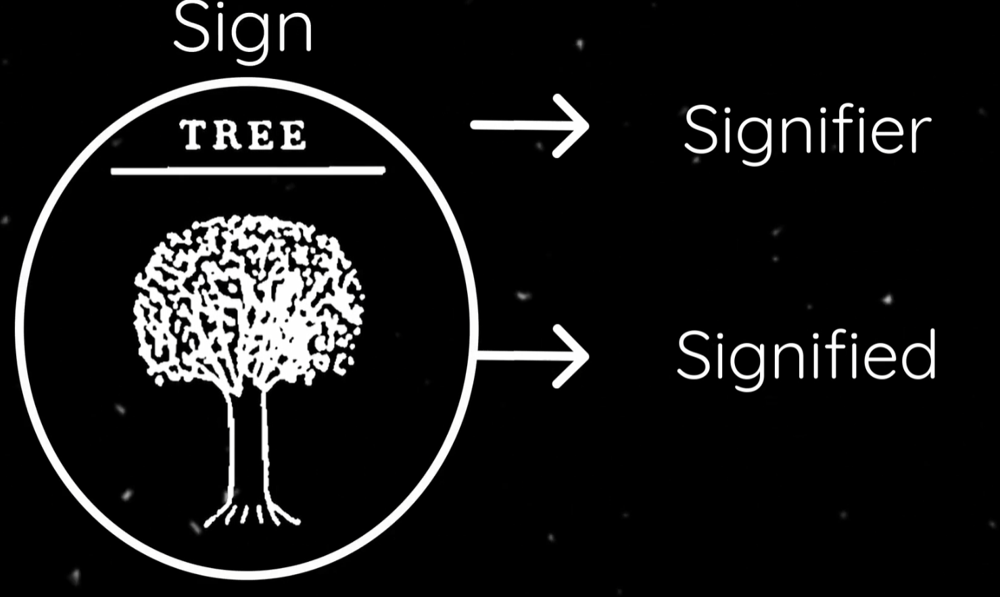
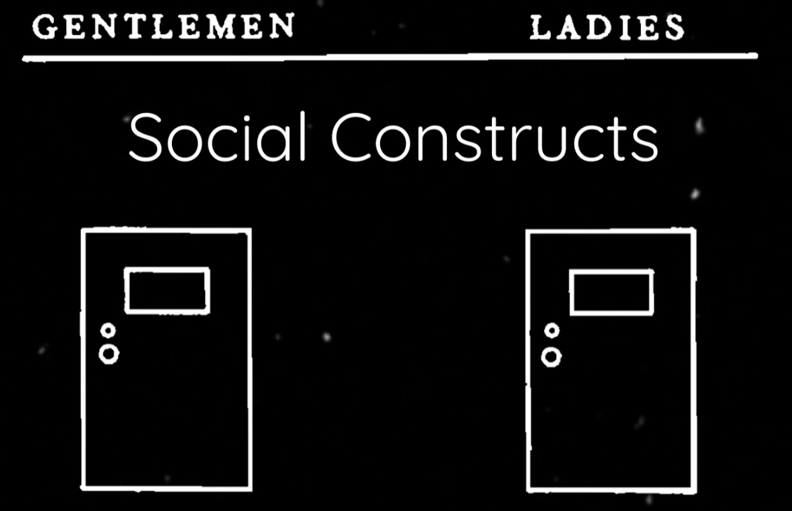
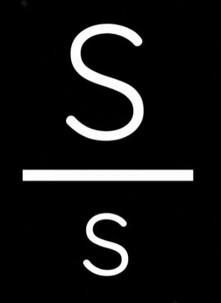
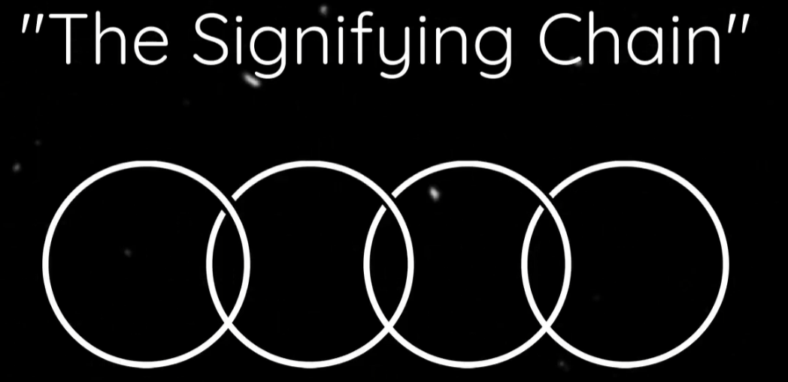
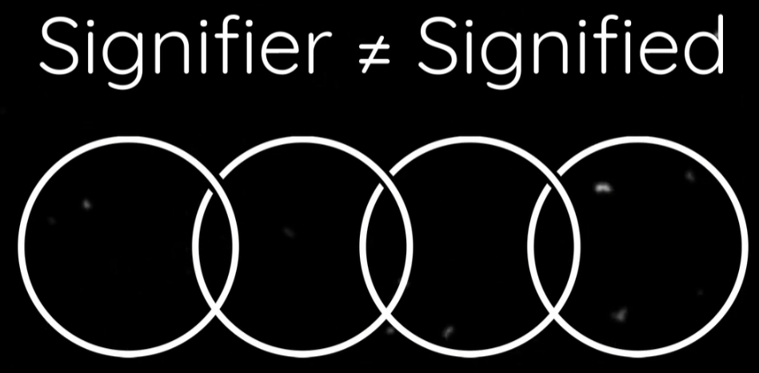
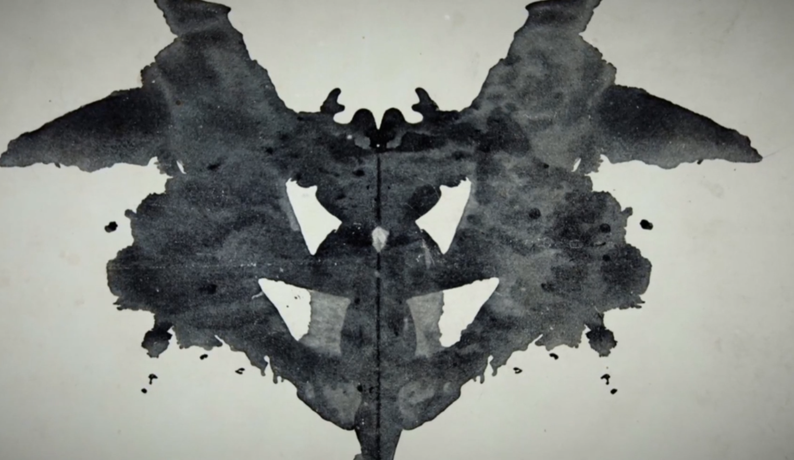

# 能指和所指

[TOC]

## 引

画家玛格利特在其一个烟斗的画作下写着 “this is not a pipe” ，该作品名为《图像的背叛》；

其实画中的烟斗只是一个呈现和表象，并非真正的烟斗，如果画作中写了“这是烟斗”，那么应该实在撒谎，毕竟画作中的烟斗只是个影像罢了；因此画中烟斗是现实烟斗的再现、一个符号，但永远不会是个实际的烟斗；

那么上面这些叙述我们是如何产生的？拉康给出了解释；

## 文字的意义  meaning of the latter

符号由两个部分组成，能指signifier和所指signified，能指是表征representation，所指是能指在描绘的内容；

这里拉康借用了索绪尔语言学的例子  【树tree】： 

【树】是现实中树的一种表征，因此【树】这个词作为能指，而其代表的【现实的树】作为所指，两者一起合成了符号；

然而，拉康认为该解释不够完全；

再看一个例子；

两个门，门上分别写着“gentlemen”和“ladies”；

门上的标志就是能指，决定了需要通过的人群，而所指的就是那个现实的门，但是门本身只是门，与门上写的内容没有关系，之所以门上的文字可区分通过人群，完全是由于社会构建导致的习惯；

> 故门只是作为承载物，能指在其本体上加载了社会意识；

由此能指限制和压制了所指；故而此时，能指signifier 凌驾于 所指signified 之上 ；

 

## 能指链 chain of signifier

就拉康来说，能指不是单独的，而是由很多能指环环相扣，词语的能指结构出句子能指，再结构出段落，再结构出书本；
单词word结构成句子sentence，单词word在句子sentence上获得不同意义，句子sentence结构为段落paragraph ，句子sentence在段落paragraph上获得不同含义，段落构成书本语境context  ，段落在书本语境context  上获得含义；
这就是拉康提出的能指链；

word → sentence → paragraph → context   

在其中能指可以互相连接或取代，其揭示了一种可能性，即能指和所指的完全分离，因此导致了能指的不透明，各大网站的评论区是典型的例子，争论到最后大家讨论的并非同一个情况；

我在与其他主体共享语言（语言存在、语言交流）的情况下，我有能力将其用于表示和字面意义完全截然不同甚至是相反的东西；
**这种言说功能可指示主体在寻求真理过程中的位置，而非仅仅掩盖主体无法定义的真实思想**；

## 转喻和隐喻 metonymy and metaphor

### 转喻 metonymy

转喻：一词换为另一词，所指不变；

即使用另一个能指来替代这一个能指，但是保持所指意义不变；因此能指依然可以有原有的所指含义；
比如： 30 sails = 30ships  使用帆代替船；

> 相当于语文中的借代和置换；

船和帆的联系只存在于能指中，转喻就存在于词和词的联系性；

置换 displacement ：感情或者行为的对象从原客体转移至另一个人或物上；

### 隐喻 metaphor

隐喻：一词换为另一词，和主体无直接联系；

雨果的诗句作为例子： His sheaf was neither miserly nor hateful.  他的禾束既不吝啬，也不怨恨；

禾束指的是谷物，当然不可能吝啬和怨恨；而这里主人公Booz被“他的禾束”即其种植的谷物取代了，这就意味着主人公既不吝啬，也不怨恨；Booz = his sheaf ； 

而不幸恰恰就在这里的 his 所有格，其代表了占有和所有权possession的真实恶意，还有不属于【禾束】本来的性质的东西；其暗指资本主义的竞争，在其中 吝啬和怨恨 很有可能发生；因此【禾束】这种无感情的非人之物来替代【主人公Booz】用于取消这种消极的一面；

凝缩 condensation ：原本被压抑之物以隐蔽的方式重现于世；

这就是语言学和无意识之间的联系

## 无意识 unconscious  

**无意识像语言一样被结构 ---- 拉康**

The unconscious is structured like a language --- Lacan

能指和所指的病理在弗洛伊德的《梦的解析》中首次提出；梦中荒诞的景象只能由其作为能指的价值来处理，让我们能够解读梦境的语言结构正是“梦的意义”的结症所在，也是解读梦境的关键；
由此拉康提出了 著名论述 “无意识像语言一样被结构”；无意识就像能指链一样，类似于语言；

> 这很好理解，人类并非一开始就有语言，其发展必须基于一种未出现语言前的思考，尽管现代人的思考大都依赖语言，而在语言未出现的古人类时代，没有词句作为所指的标的物，其行为和情感的逻辑链条只能够是原始想法（毕竟想法不被语言定义就不是所谓意识），即未被语言结构的【想法】；而对于现代人语言的能指又凌驾于所指之上，重构人类无意识和欲望的生产；故而拉康所说的无意识就是被语言雕刻了的想法链条；能指链带动了无意识的同构发展，让人有了所谓的意识； 

例子：自由联想 free association 

罗夏墨迹投射测验（如今被庸俗心理学所推崇），给病人展示图像，让其分享涌现出的任何想法和实践，可以牵出一系列能指链纽带；而这里拉康和其老师弗洛伊德有分歧；

无意识被结构未我们本能所在的位置，也是我们的欲望生产之地  --- 弗洛伊德
并非我们的欲望和愿望（libido）通过语言表达，而是语言自身创造了欲望 --- 拉康

It is not that our desires are expressed through language, but the language creates the desires...It is language that enabled us to become conscious. 

我们不是先有意识才发展出语言，而是语言让我们能够具备意识；语言出现前所有所谓的意识只是【想法】；所以意识始于文字；文字是欲望本身；

**无意识并非天然或本能的，其所知的元素也只不过是能指的元素而已**；

## 总结 conslusion

Linguistic & Unconscious  语言和无意识

Lacan: "The unconscious is structured like a language."   拉康：无意识如语言一般结构；

### 故事神话或者宗教文本中的分析

符号必须首先更具其作为能指的价值作为评估，而非物理上的表达；

如同我们说的 【西方的龙】，其当然是虚构的生物，而其能指就是 恐惧和征服的潜在概念的象征；

### 语言分析让我们更好理解心理学中的病理和意识形态的复杂系统；

如同就算现代最为具有实用性的商品也会被用作象征维度的意义表示；

当你买了牛仔裤，也就表达自己是个不讲究的人，而买了跑车则是展示自己的较高的社会地位，即使你声称对其不在乎，其明确指出了这点，这时反而是宣告了某些东西； --- 齐泽克

 

