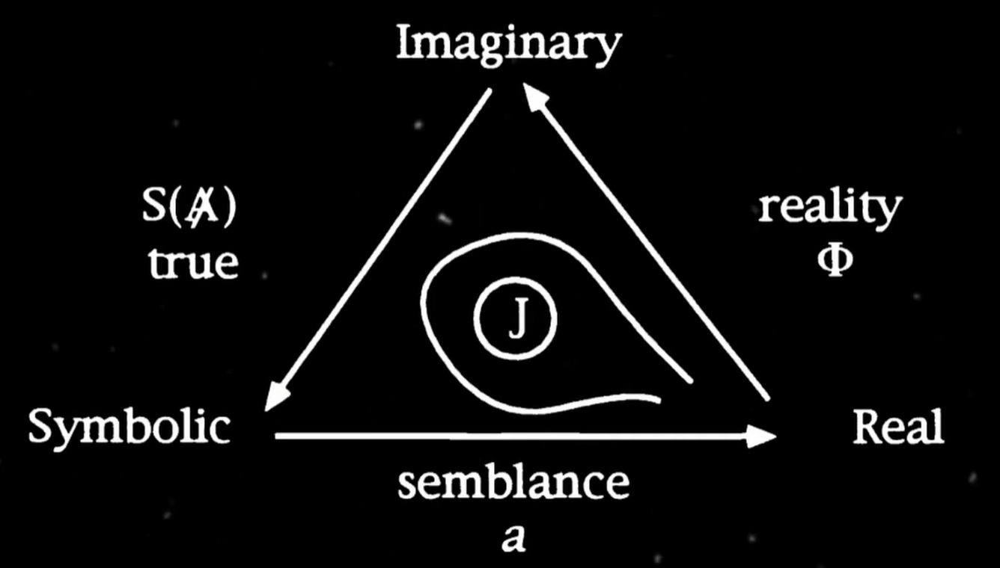
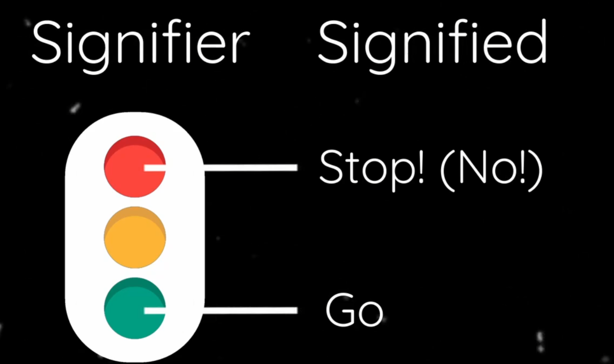
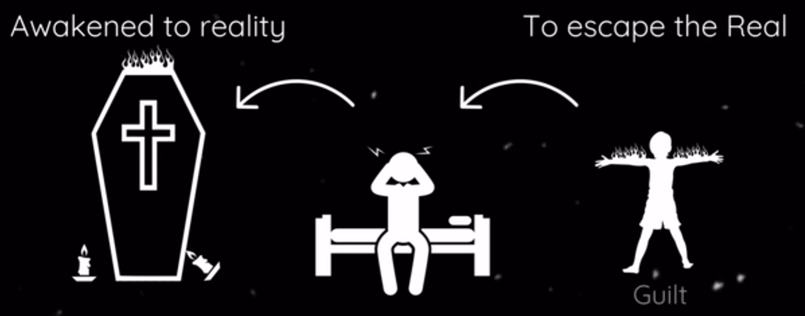

# 三界理论

[TOC]

## 什么是三界

拉康认为我们都是【主体 subject】

那么什么是主体？ 
拉康将人类的现实主体分为三个层次：想象界 imaginary，象征界 symbolic，实在界 real；

齐泽克使用简单国际象棋作为简化表达；

人们进行游戏必须遵守规则，即象征维度；从存粹的象征出发，棋子能够走的路径只能被棋子可以最初的移动规定下来；
想象界则是不同角色别冠以不同的名称刻画和塑造，如 皇后 士兵 国王 等；
于是仅仅基于象征维度我们很容易可以想象出一个规则相同但是角色不同的游戏；
实在界是影响游戏进程所有偶然清境的复杂集合，玩家水平，注意力或者中断游戏的不可测干扰；

棋子被视为能指，如”马“象征物代表了其在游戏规则下允许的特定具体的移动方式

因此， 棋子作为想象的元素处于想象界；棋子的移动方式由象征秩序决定，游戏本身就是实在界；

## 想象界

### 镜像阶段：

婴儿在某个时期看自己在镜子中的自己，开始在镜子中认识自己，镜子中的自己是一个完整的形象，当然我们知道现实中自己是支离破碎的被撕扯的（矛盾、割裂、不统一），然而我们更加喜欢看到完整的形象，因此我们认同了镜中那理想的自我形象，于是我们认同了镜子中的那个自我形象，如此构建了 理想自我 ideal-I ，即自我  EGO； 

当然这是一种认同，当主体承担或者假定一个形象时于其身上发生的转变；

幼儿阶段的小孩子依然处于被供养和无能力的阶段，其自然接纳了这种”我“的形式，这个”我“是陷于原初形式的象征矩阵； 然后于他者之间辩证认同而将自己对象化，此时语言的普遍性恢复了作为主体的功能；这个就是理想自我；这里理性自我也是其他次级认同的根基，次级认同含有 爱欲规范化 libidinal normalization 的多种功能 ;
而这里的重点在于，这一形式将”自我“的能动性先于其社会性决定而安置在一条对于单一个体而言永远不可约化的虚构路线，即 使用任何辩证综合来解决我与自身现实的不一致，都只能渐进主体形成，而无法永远完全实现；

> 理想自我无法通过任何辩证综合路线完成，因为仅仅考虑自身其不将矛盾放入社会性中流转，那么在”我“这个形象构建中必然会有自我的理想和现实的不一致，二者统一却矛盾，所以称这条是虚构路线；而该路线进入社会性部分则需要另作考察；

### 自我？面具！

此时我们构建了一个堪用的自我，成为了一个 person ，该词拉丁词源未 persono 意思是通过声音，参考拉丁语中的persona，即为戏剧中的面具的意思，然而这个词现在用来描述人；

how to be a real person  ==  how to be a real fake     （person 作为面具暗示为 fake 假面）

上述的镜子是镜子，然而社会中的他者也是镜子，我们可以从社会交往中也看出端倪；关注他人反映的言语、手势、姿势、情绪、表情，我们只有在他人的反应和映像中我们才能成为自己；他性的实现和他者对我们自我形象的影响依然继续发挥着作用；这是我们注册象征界的时刻；

## 象征界

象征界即拉康所谓的大他者 big other  
大他者：是构建现实体验的无形秩序，是一个复杂规则的意义网络，以我们所看到的方式看到我们所见之物，以及我们以我们看不到的方式看不见我们没看到的事物；

象征界是能指和所指的界域，人类目前自从孩童进入语言阶段后总是非常重视培养，毕竟现代人的最佳生存策略是社会化，这便意味着我们必须抑制自己的欲望和享乐 jouissance ，这种压抑的主要能指就是 NO ，这里我们看到了大他者  其使用法律规范语言等来限制，这个限制可以是父母、老师、政治家等，也可以权威人物的阻碍，如父性文化或者拉康所谓的【父之名】， 以此可见，将增殖归因于父亲只能是存粹的符号效用，而非真正的血缘认同，而是宗教所称的【父之名】的符号，宗教只是将大他者的符号化系统，不论书面法律还是无形的价值体系；

对于所谓的上帝来说，除了大他者之外他还是什么？

上帝是【父之名】就是我们熟悉的文化 禁令教条等，当我们不知道文化为何物，我们只知道上帝，其实文化中的价值体系就是上帝的发源之处，作为生活中一切的永恒的审判之父，如同父母 祖父母 政治家 其他人等 在我们的眼中都是大他者，评价我们所做的一切，就像一把尺，以衡量我自己的，因此大他者总是可以拟人化或者具象化为单一的代理者，就像有个上帝在天上评价一般，或者是如同那些愿意位置付出生命的对象 国家 事业 理念 理想 等，当我交谈时其他只是小他者，而大他者总是在那里；

例如 红绿灯

依然是现实的红绿灯没有其意义，其意义是由人们的规定和约定决定了所指；人和人之间的协议宰制了我们的现实；

与他人交流也能够见到大他者，我们必须在语言系统中才能够交流；  

我们所遵循的规则具有明显的裂缝，有些规则我们盲目遵守，但是反思一下就可以意识到，如语法规范等，还有些规则我们在无知中遵守，其意义困扰着我，如同无意识的禁令，还有些我们知道却依然不能够表达，为了维持表象而沉默，如同一些肮脏淫秽的影射；

因此，想象界和象征界构成了我们的现实  imaginary+symbolic= reality

> 当然这里的现实reality不是拉康的实在界real

## 实在界

实在界不仅仅是外部现实， 拉康：实在界是不可能，一种不能直接体验和符号化的东西，像是一次极端暴力的创伤，实在界只能够通过其余波来考察，我们的现实与之不同，甚至现实reality可以用于逃避实在real的手段； 

**reality is our esacape from the real  --  现实是对实在的逃避**

由于现实是想象界和象征界构成的幻想（幻象），充当了屏障保护不被原始的实在界所淹没，那么现实就可以作为逃避实在界的手段，因此梦和现实对立的情况下，幻想位于现实处，而人们在梦中遭遇实在界冲击的角色，梦不是为了无法忍受现实的人准备的而是无法忍受实在界的人准备的；

拉康举例

一位丧子的父亲睡在儿子棺材边上，在梦中梦见儿子身上着火并喊道”爸爸！没看到我着火了吗？“ 此时父亲忽然醒来，发现蜡烛引燃了棺材上的布条，发出浓烟；

那么上述的情景中，导致父亲惊醒的是什么？

此时我们可能回答，是火灾导致的烟使人醒来，但是我们要说其实是父亲在梦中受到的创伤导致其惊醒；
当烟雾影响到了睡眠，其在梦中引入烟雾等构建了梦境以延长睡眠，但是其越大更加真实的创伤，比如对于儿子死亡的愧疚感，于是从梦中惊醒进入现实以逃避实在界的淹没；

## 总结

从无意识中认知到了欲望和真实；

awaken from the real fantasy,and to see real and all the hidden forces that guide our everyday life.

精神分析的真实任务是穿越幻想，看到我们日常生活中正是以及隐藏着的力量；

